# Kabot - lowering entry barrier for mobile robotics

The Kabot robot is a hardware and software solution that aims to lower the entry barrier to mobile robotics. The concept is based around simple network-enabled embedded platform (i.e. ESP32-S3) with firmware based on Zehyr RTOS, which has sensors and actuators connected to it, and sends `State` and receives `Control` messages from much beefier processing unit - the computer. This split allows the hardware to be small and cost effective, while the hardware that has the processing power for more advanced algorithms is already available for the person willing to dive into the world of robotics.

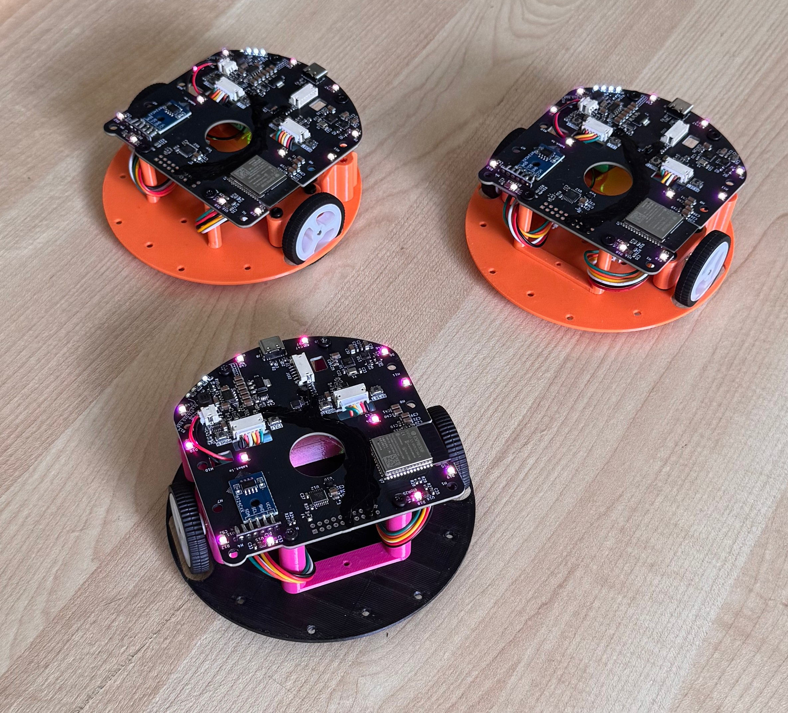

## Table of Contents

- [Kabot - lowering entry barrier for mobile robotics](#kabot---lowering-entry-barrier-for-mobile-robotics)
  - [Table of Contents](#table-of-contents)
  - [Hardware - Electronics and Mechanics ](#hardware---electronics-and-mechanics-)
    - [Processing section  ](#processing-section--)
    - [Power section  ](#power-section--)
    - [Sensors section  ](#sensors-section--)
  - [Software - Human Machine Interface and Firmware  ](#software---human-machine-interface-and-firmware--)
    - [Human Machine Interface  ](#human-machine-interface--)
    - [Firmware  ](#firmware--)

## Hardware - [Electronics and Mechanics](github.com/kabot-io/kabot-hardware/) 

[link to repo](https://github.com/kabot-io/kabot-hardware/)

Currently, the robot hardware is at its second revision, packed with cost-effective features, in contrary to the first version, which was completely bare-bones. The mechanical parts are designed using [FreeCAD](https://www.freecad.org/) and 3D printed with some little exceptions, which were not viable to print due to the low cost of China-sourced parts, such as wheels. The electronics has been designed using [KiCad](https://www.kicad.org/) and consist of few distinct sections (however, on a single PCB).

### Processing section  
Based on the [ESP32-S3-N16R8 MCU on Wroom-1 module](https://documentation.espressif.com/esp32-s3-wroom-1_wroom-1u_datasheet_en.pdf), which is responsible for communication with the PC, fetching data from the sensors, and executing control messages - driving the motors.

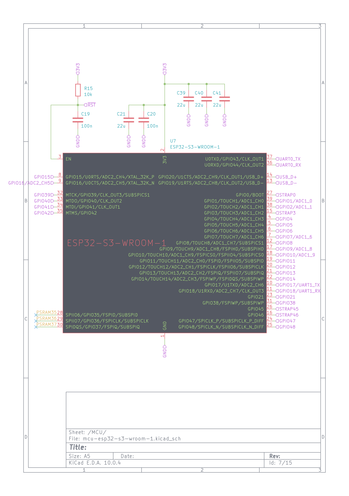

This MCU has a [built-in USB JTAG](https://docs.espressif.com/projects/esp-idf/en/stable/esp32s3/api-guides/jtag-debugging/index.html) interface, which allows for flashing and debugging the robot firmware without the need of *any* external tools, besides USB-C cable. 

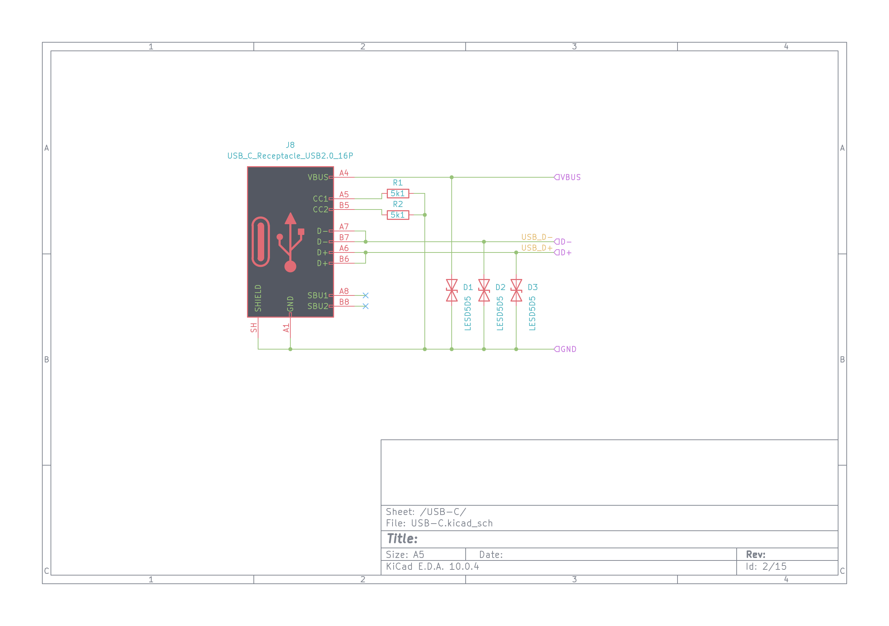

There is also onboard USB HUB ([CH334F](https://cdn-learn.adafruit.com/assets/assets/000/131/435/original/CH334DS1.PDF?1721660148)) and USB-to-serial adapter ([CH343P](https://cdn-learn.adafruit.com/assets/assets/000/134/549/original/CH343DS1.PDF?1737477957)), which allows for connecting to the robot over the raw UART interface, which exposes [first-stage bootloader](https://docs.espressif.com/projects/esp-idf/en/stable/esp32s3/api-guides/bootloader.html) logs, and a connector which allows for splitting the USB-C lanes, and injecting offboard processing units, such as embedded Linux board (instead of the beefy PC, to make the robot self-contained if needed) 

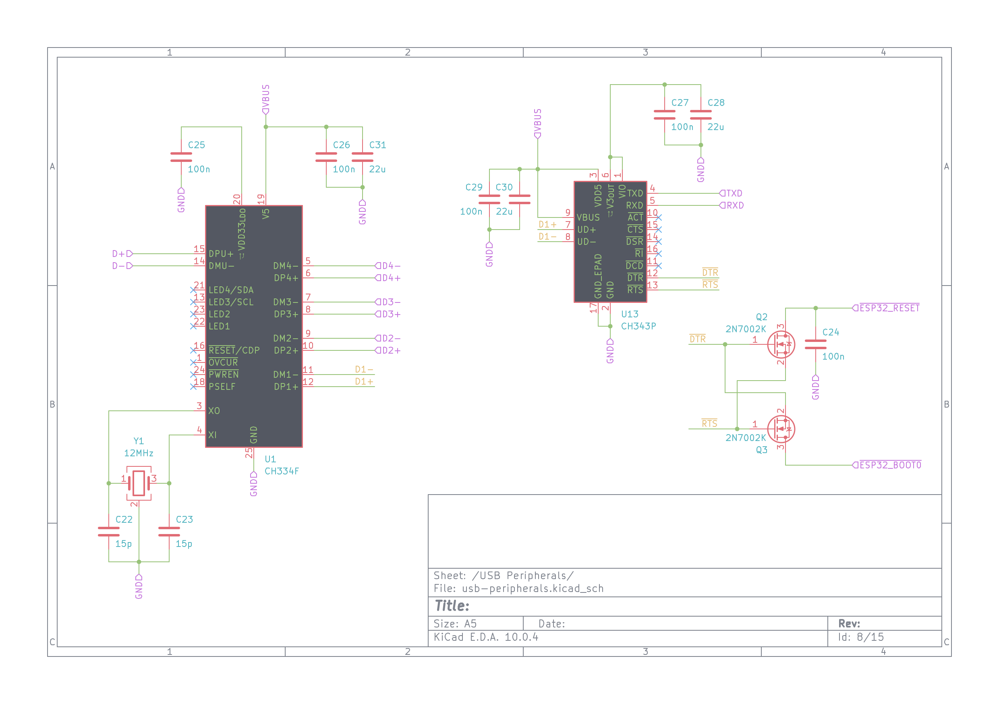

### Power section  
The USB-C connector that is used to program the robot, is also used to charge the robot built-in battery, which is a single Lithium-Ion 18650 sized cell. The same chip is also responsible for stepping the battery voltage up to 5V, which is then fed to the motor drivers to have somehat stable motor power supply, and stabilized to 3.3V for the MCU. The chip is the thing used in powerbanks - [INJOINIC IP5306](https://www.lcsc.com/datasheet/C181692.pdf).

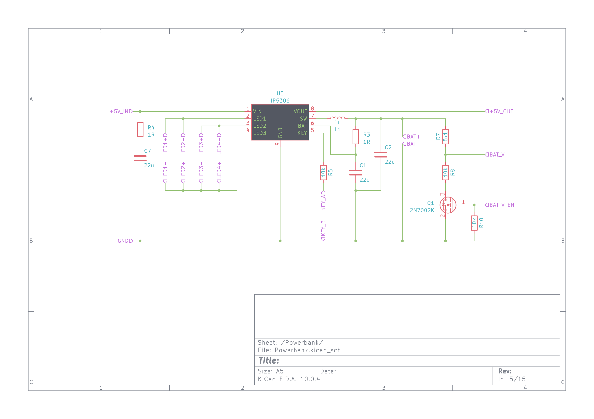

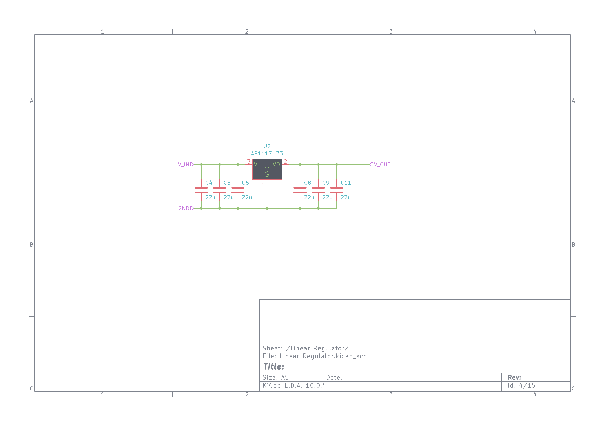

Motors are driven by two [DRV8837](https://www.ti.com/lit/ds/symlink/drv8838.pdf) motor drivers (up to 1.8A per motor). Each motor driver is supplied via [INA219](https://www.ti.com/lit/ds/symlink/ina219.pdf) I2C Current/Power monitor. The motors are chinese [N20 sized 298:1 micro gearmotors, equipped with magnetic incremental encoders](https://pl.aliexpress.com/item/1005007102441781.html). The power supply branch for the rest of the system also has it's own IN219 sensor. There is also voltage divider connected directly do the battery terminals (or rather semi-directly - via a switch that gets opened when the robot is not powered up, to avoid entirely draining the battery). 

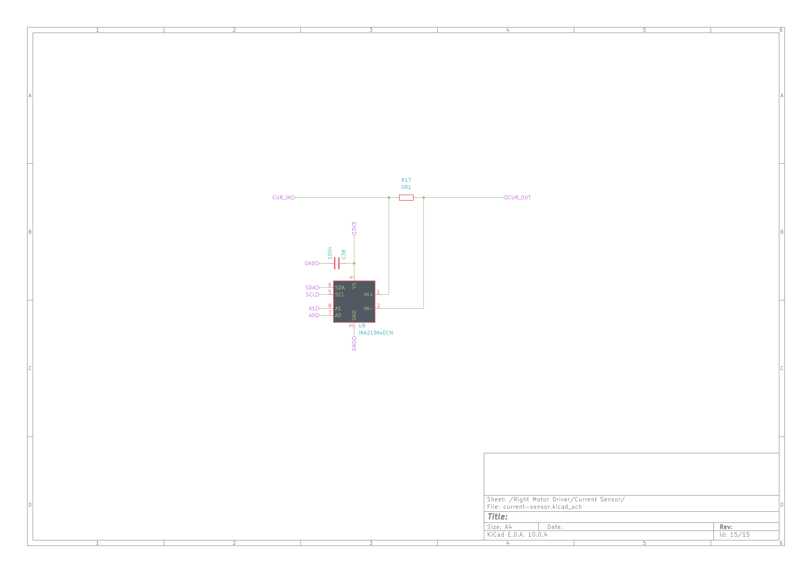

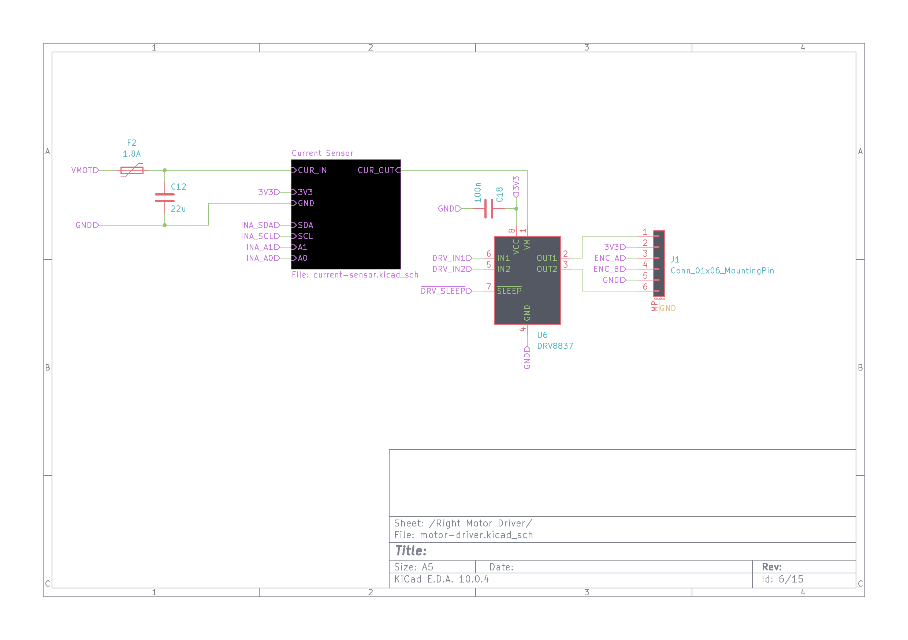
### Sensors section  

Besides the current sensors and encoders, robot has a bunch of on-board sensors:
- 6 Degrees of Freedon Inertial Measurement Unit: [TDK ICM-42670-L](https://datasheet.lcsc.com/datasheet/pdf/874d19cb3cf7cf4a72e58391bfc479df.pdf)
- 3 Degrees of Freedom Magnetometer: [MEMSIC MMC5603NJ](https://www.lcsc.com/datasheet/C404328.pdf)
- dual visible light sensors (left and right): [LITEON LTR-303-ALS](https://www.lcsc.com/datasheet/C364577.pdf)
- distance sensor - [ST VL53L0X](https://www.st.com/resource/en/datasheet/vl53l0x.pdf) on the GY-530 footprint module - this allows for supplying different distance sensors, sucha as 8x8 grid [ST VL53L5X](https://www.st.com/resource/en/datasheet/vl53l5cx.pdf) ToF sensor

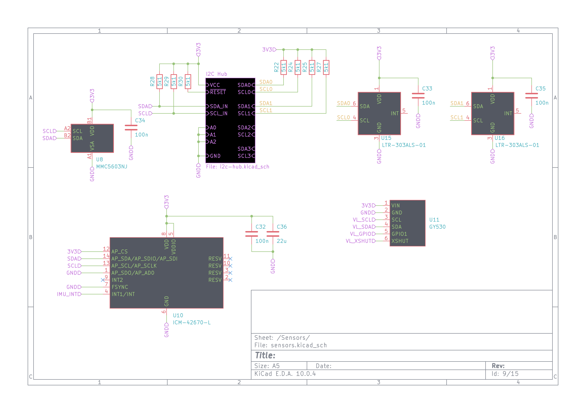
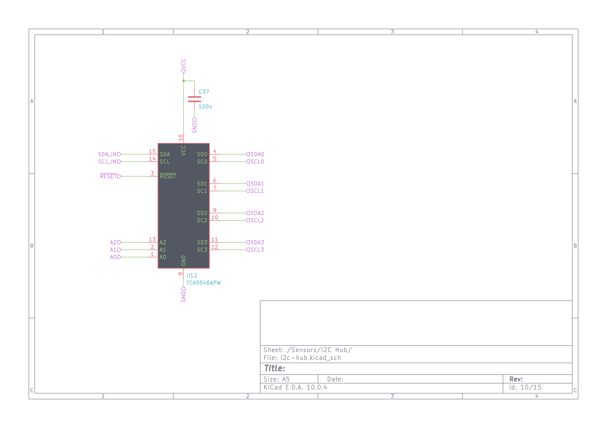

These allow for implementing a wide variety of algorithms - from simple [BEAM](https://en.wikipedia.org/wiki/BEAM_robotics)-like photovores, trough IMU sensor fusion up to localization and mapping.

The board also supplies a bunch of addresable RGB LEDs.

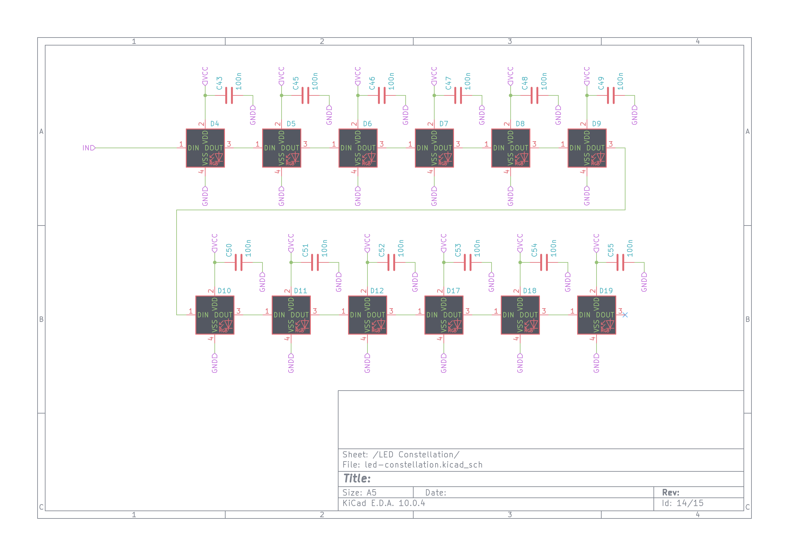

## Software - [Human Machine Interface](https://github.com/kabot-io/kabot-hmi) and [Firmware](https://github.com/kabot-io/kabot-zephyr)  

### Human Machine Interface  

[link to repo](https://github.com/kabot-io/kabot-hmi/)

To make the robot algorithms writing as simple and comfortable as possible, a Human-Machine-Interface has been developed. The HMI is kept to be as welcoming as possible, similar to the Arduino IDE - only the necessary stuff is exposed to the user, and it is exposed in as readable and simple as possible manner. The HMI connectos to the robot and acts as a sensor values plotter and robot controller. User writes Python code, which is then executed on the PC, fed the sensor readings, end outputs motor controls to the robot. The built-in code editor has syntax highlighting and displays runtime errors and exceptions next to the code line. The HMI also allows for Over-the-Air firmware updates of the robot firmware.

### Firmware  

[link to repo](https://github.com/kabot-io/kabot-zephyr/)

Firmware of the robot is based on the [Zephyr Real Time Operating System](https://www.zephyrproject.org/). The main purpose of the firmware is to get the sensor readings, send them to the PC and act based on the control messages from this PC. Beyond that, the firmware also allows for discovery of the robots connected to the same network, blinking lights and exposes Zephyr shell over Serial over USB connection, that allows for tinkering with the firmware on the lower level (and providing wifi credentials).  

[Hackaday.io Project](https://hackaday.io/project/190768)
